# RT-Thrad架构

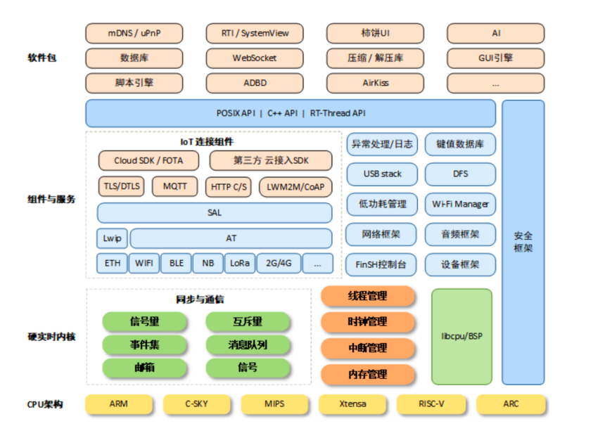

# RT-Thrad移植

## RT-Thrad版本

### 标准版本


即为标准版本【cpu架构表示的是RT-Thrad支持的系统架构，而不是RT-Thrad系统】

### Nano版本

RT-Thread Nano 是一个极简版的硬实时内核。

它是由 C 语言开发，采用面向对象的编程思维，具有良好的代码风格，是一款可裁剪的、抢占式实时多任务的 RTOS。

其内存资源占用极小，功能包括任务处理、软件定时器、信号量、邮箱和实时调度等相对完整的实时操作系统特性

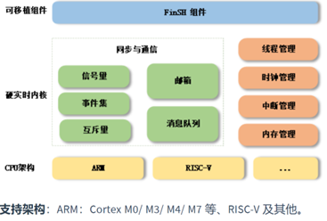

功能：线程管理、线程间同步与通信、时钟管理、中断管理、内存管理。

### Smart版本

T-Thread Smart 是基于 RT-Thread 操作系统上的混合操作系统，简称为 rt-smart，它把应用从内核中独立出来，形成独立的用户态应用程序，并具备独立的地址空间（32 位系统上是 4G 的独立地址空间）

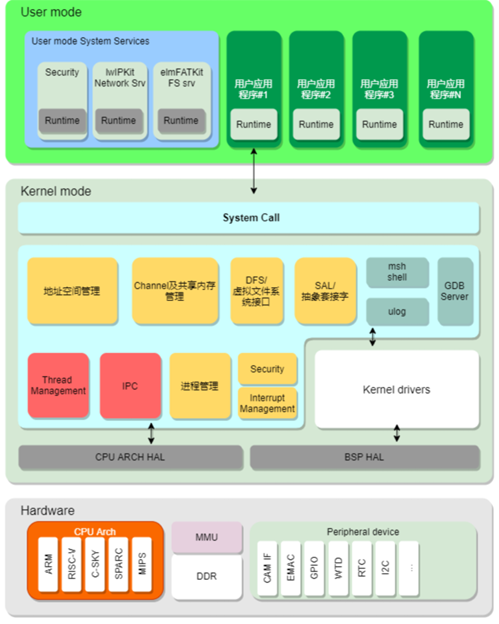

## 创建项目

具体收发串口需要见 开发板的文档。

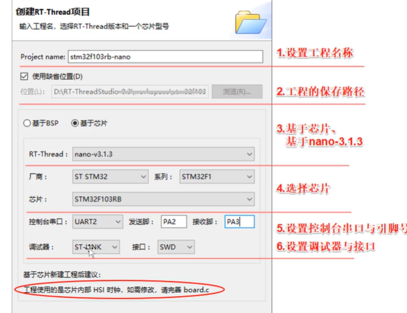

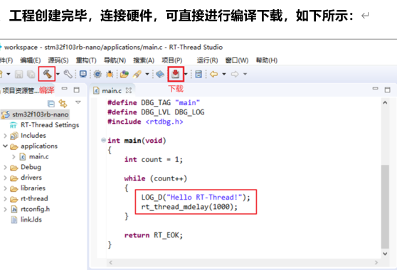

- 可以通过修改board.c的 SystemClock_Config()更改系统时钟

- 由于在创建工程向导中配置了控制台串口号及其引脚号，所以工程中已经实现了uart的驱动以及 rt_hw_console_output()，默认可以进行打印。

## RTT时钟配置

```c
//在drivers 文件下 的board.h 中
//#define BSP_CLOCK_SOURCE                  ("HSI")
//#define BSP_CLOCK_SOURCE_FREQ_MHZ         ((int32_t)0)
#define BSP_CLOCK_SOURCE                  ("HSE")  //改为外部的高速时钟
#define BSP_CLOCK_SOURCE_FREQ_MHZ         ((int32_t)8) //改为外部的高速时钟频率改为8M赫兹
#define BSP_CLOCK_SYSTEM_FREQ_MHZ         ((int32_t)72)

```

## 终端调试FinSH

双击RT-Thread Settings进入配置，打开组件，勾选 FinSH Shell，保存配置。

此操作将把 FinSH组件的源码加入工程中。

其中，rt_hw_console_getchar()已经在drv_uart.c中实现，无需再实现对接FinSH的代码。

# 内核

内核是操作系统最基础也是最重要的部分。下图为 RT-Thread内核架构图，内核处于硬件层之上，内核部分包括内核库、实时内核实现。

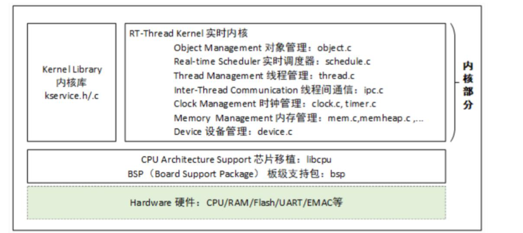

内核库是为了保证内核能够独立运行的一套小型的类似C库的函数实现子集。

这部分根据编译器的不同自带C库的情况也会有些不同，当使用GNUcCC编译器时，会携带更多的标准C库实现。

实时内核的实现包括:

- 对象管理
- 线程管理及调度器
- 线程间通信管理
- 时钟管理
- 内存管理
- 设备管理

内核最小的资源占用情况是 3KB ROM，1.2KB RAM

## 内核启动流程

RT-Thread支持多种平台和多种编译器，而rtthread_startup()函数是RT-Thread规定的统一启动入口。

一般执行顺序是:系统先从启动文件开始运行，然后进入RT-hread的启动rtthread_startup()，最后进入用户入口main()，如下图所示:

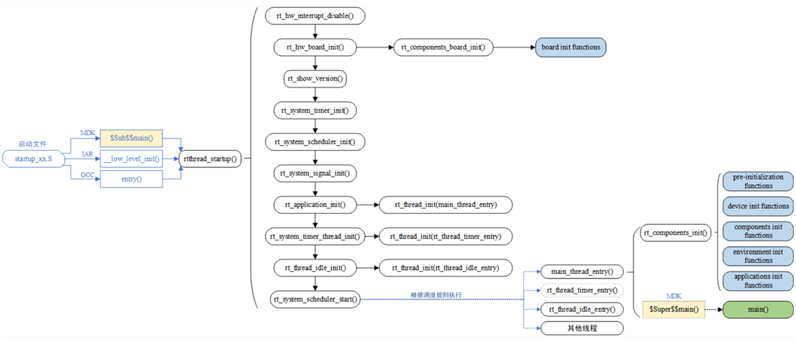

# 线程控制块

RT-Thread是支持多任务的操作系统，多任务是通过多线程的方式实现。线程是任务的载体，是RTT中最基本的调度单位。

线程在运行的时候，它自己会认为独占CPU运行

线程执行时的运行环境称为上下文，具体来说就是各个变量和数据，包括所有的寄存器变量、堆栈、内存信息等

## 线程管理特点

RT-Thread 线程管理的主要功能是对线程进行管理和调度，系统中总共存在两类线程，分别是系统线程和用户线程

- 系统线程是由 RT-Thread 内核创建的线程，
- 用户线程是由应用程序创建的线程

这两类线程都会从内核对象容器中分配线程对象，当线程被删除时，也会被从对象容器中删除。

RT-Thread 的线程调度器是抢占式的，主要的工作就是从就绪线程列表中查找最高优先级线程，保证最高优先级的线程能够被运行，最高优先级的任务一旦就绪，总能得到 CPU 的使用权。

当调度器调度线程切换时，先将当前线程上下文保存起来，当再切回到这个线程时，线程调度器将该线程的上下文信息恢复。

## 线程工作机制

线程控制块由结构体 struct rt_thread 表示，线程控制块是操作系统用于管理线程的一个数据结构，它会存放线程的一些信息，例如优先级、线程名称、线程状态等，也包含线程与线程之间连接用的链表结构，线程等待事件集合等。

```c
struct rt_thread
{
    /* rt object */
    char        name[RT_NAME_MAX];       /**< the name of thread */
    rt_uint8_t  type;               /**< type of object */
    rt_uint8_t  flags;               /**< thread's flags */

    rt_list_t   list;                    /**< the object list */
    rt_list_t   tlist;                   /**< the thread list */

    /* stack point and entry */
    void       *sp;                     /**< stack point 栈指针*/  
    void       *entry;                 /**< entry */
    void       *parameter;          /**< parameter */
    void       *stack_addr;         /**< stack address point 栈地址指针*/
    rt_uint32_t stack_size;       /**< stack size */

    /* error code */
    rt_err_t    error;                   /**< error code */
    rt_uint8_t  stat;                    /**< thread status 线程状态*/

    /* priority */
    rt_uint8_t  current_priority;        /**< current priority */
    rt_uint8_t  init_priority;           /**< initialized priority */

    rt_uint32_t number_mask;

    //...

    rt_ubase_t  init_tick;                          /**< thread's initialized tick */
    rt_ubase_t  remaining_tick;                /**< remaining tick */

    struct rt_timer thread_timer;              /**< built-in thread timer */

    void (*cleanup)(struct rt_thread *tid);    /**< cleanup function when thread exit */

    rt_uint32_t user_data;                          /**< private user data beyond this thread */
};

```

*注：cleanup函数指针指向的函数，会在线程退出的时候，被idle线程回调一次，执行用户设置的清理现场等工作。*

## 线程属性

 **线程栈**:

- RT-Thread 线程具有独立的栈，当进行线程切换时，会将当前线程的上下文存在栈中，当线程要恢复运行时，再从栈中读取上下文信息，进行恢复。

**线程状态**:

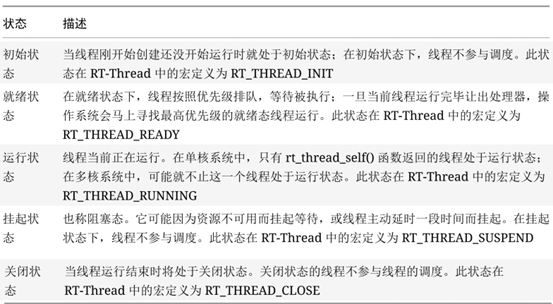

**线程优先级**:

- RT-Thread 最大支持 256 个线程优先级 (0~255)，数值越小的优先级越高，0 为最高优先级。
- 在一些资源比较紧张的系统中，可以根据实际情况选择只支持 8 个或 32 个优先级的系统配置；
- 对于 ARM Cortex-M系列，普遍采用 32 个优先级。
- 最低优先级默认分配给空闲线程使用，用户一般不使用。
- 在系统中，当有比当前线程优先级更高的线程就绪时，当前线程将立刻被换出，高优先级线程抢占处理器运行

**时间片**:

每个线程都有时间片这个参数，但时间片仅对优先级相同的就绪态线程有效。

**注意：**

*作为一个实时系统，一个优先级明确的实时系统，如果一个线程中的程序陷入了死循环操作，那么比它优先级低的线程都将不能够得到执行。*

*所以在实时操作系统中必须注意的一点就是：*

*线程中不能陷入死循环操作，必须要有让出 CPU使用权的动作，如循环中调用延时函数或者主动挂起。*

## 线程状态之间切换

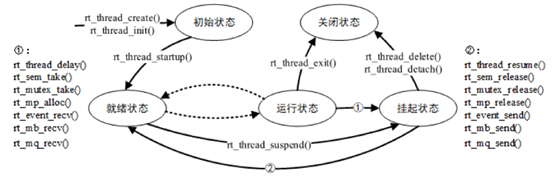

***注：就绪状态和运行状态是等同的\***

RT-Thread 内核中的系统线程有空闲线程和主线程。

## 线程相关操作

线程相关的操作包括：创建/初始化、启动、运行、删除/脱离。

动态线程与静态线程的区别是：

- 动态线程是系统自动从动态内存堆上分配栈空间与线程句柄（初始化 heap 之后才能使用 create 创建动态线程），
- 静态线程是由用户分配栈空间与线程句柄。

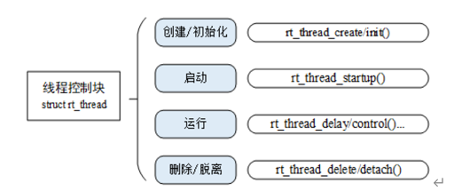

### 创建和删除线程

```c
/**
此函数将创建一个线程对象，并为线程对象分配内存和栈。
@param name 线程的名称，该名称应是唯一的
@param entry 线程的入口函数
@param parameter 线程入口函数entry的参数
@param stack_size 线程栈的大小
@param priority 线程的优先级
@param tick 	如果存在相同优先级的线程，此为时间片
@return 		创建的线程对象
*/
rt_thread_t rt_thread_create(
    const char *name,
    void (*entry)(void *parameter),
    void   *parameter,
    rt_uint32_t stack_size,
    rt_uint8_t  priority,
    rt_uint32_t tick
);

/**
此函数将删除一个线程。线程对象将从线程队列中移除，并在空闲线程中从系统对象管理中删除。
@param thread 要删除的线程
@return 操作状态，RT_EOK 表示成功，-RT_ERROR 表示错误
*/
rt_err_t rt_thread_delete(rt_thread_t thread)

```

案例

```c
rt_thread_t th1=NULL;;
void demoEntry(void *parameter){
  while(1){
    rt_kprintf("entry_runing");
    rt_thread_mdelay(1000);
  }
}
int main(void)
{
    th1= rt_thread_create(
        "demo",
        demoEntry,
        NULL,
        1024,
        20,
        5
    );
   if(th1==RT_NULL){
       LOG_E("creater bug\n");
   }

    return RT_EOK;
}
```


### 初始化和脱离静态线程

```c
/**
此函数将初始化一个线程，通常用于初始化一个静态线程对象。
@param thread 静态线程对象
@param name 线程的名称，该名称应是唯一的
@param entry 线程的入口函数
@param parameter 线程入口函数的参数
@param stack_start 线程栈的起始地址
@param stack_size 线程栈的大小
@param priority 线程的优先级
@param tick 如果存在相同优先级的线程，此为时间片
@return 操作状态，RT_EOK 表示成功，-RT_ERROR 表示错误
*/
rt_err_t rt_thread_init(
    struct rt_thread *thread,
    const char *name,
    void (*entry)(void *parameter),
    void *parameter,
    void *stack_start,
    rt_uint32_t stack_size,
    rt_uint8_t priority,
    rt_uint32_t tick
);

/**
此函数将分离一个线程。线程对象将从线程队列中移除，并从系统对象管理中分离/删除。
@param thread 要删除的线程
@return 操作状态，RT_EOK 表示成功，-RT_ERROR 表示错误
*/
rt_err_t rt_thread_detach(rt_thread_t thread)
```


```c
rt_err_t th2=NULL;
struct rt_thread myRt_thread;
rt_uint8_t th2_stack[512]={0};

void demoEntry2(void *parameter){
    int i=10;
    while(i--){
        rt_kprintf("entry_runing2");
        rt_thread_mdelay(1000);
    }
}
th2= rt_thread_init(
    &myRt_thread,
    "demo2",
    demoEntry2,
    NULL,
    th2_stack,
    sizeof(th2_stack),
    19,
    5
);
if(th2==RT_NULL){
    LOG_E("creater2 bug\n");
    return -1;
}
rt_thread_startup(&myRt_thread);
```


### 启动线程

```c
/**
此函数将启动一个线程并将其放入系统就绪队列
@param thread 要启动的线程
@return 操作状态，RT_EOK 表示成功，-RT_ERROR 表示错误
*/
rt_err_t rt_thread_startup(rt_thread_t thread)
```

*注：当调用这个函数时，将把线程的状态更改为就绪状态，并放到相应优先级队列中等待调度。如果新启动的线程优先级比当前线程优先级高，将立刻切换到这个线程。*

```c
 rt_thread_startup(th1); //启动之后处于运行态
```

### 获得当前线程

在程序的运行过程中，相同的一段代码可能会被多个线程执行，在执行的时候可以通过下面的函数接口获得当前执行的线程句柄

```c
/**
此函数将返回自身线程对象
@return 自身线程对象，失败则返回 RT_NULL
*/
rt_thread_t rt_thread_self(void)
```

### 让出处理器资源

```c
/**
此函数将使当前线程让出处理器，并且调度器将选择一个最高（优先级）的线程来运行。让出处理器后，当前线程仍处于就绪状态。
@return RT_EOK
*/
rt_err_t rt_thread_yield(void)
```

### 线程睡眠

```c
/**
此函数将使当前线程睡眠若干个时钟节拍。
@param tick 睡眠的时钟节拍数
@return RT_EOK
*/
rt_err_t rt_thread_sleep(rt_tick_t tick);
rt_err_t rt_thread_delay(rt_tick_t tick);

/**
此函数将使当前线程延迟若干毫秒。
@param ms 延迟的时间（毫秒）
@return RT_EOK
*/
rt_err_t rt_thread_mdelay(rt_int32_t ms)
```

### 控制线程函数

```c
/**
此函数将根据控制命令来控制线程的行为。
@param thread 要被控制的指定线程
@param cmd 控制命令，其中包括
	RT_THREAD_CTRL_CHANGE_PRIORITY 用于更改线程的优先级；
	RT_THREAD_CTRL_STARTUP 用于启动一个线程； == 		rt_thread_startup()
	RT_THREAD_CTRL_CLOSE 用于删除一个线程； == rt_thread_delete()
	RT_THREAD_CTRL_BIND_CPU 用于将线程绑定到一个 CPU。
@param arg 控制命令的参数
@return RT_EOK
*/
rt_err_t rt_thread_control(rt_thread_t thread, int cmd, void *arg)
```

### 设置和删除idle线程hook函数

```c
/**
@ingroup Hook
此函数为空闲线程循环设置一个钩子函数。当系统执行空闲循环时，应调用此钩子函数。
@param hook 指定的钩子函数
@return RT_EOK: 设置成功
-RT_EFULL: 钩子列表已满
@note 钩子函数必须简单，且永远不会被阻塞或挂起。
*/
rt_err_t rt_thread_idle_sethook(void (*hook)(void));


/**
删除钩子列表中的空闲钩子
@param hook 指定的钩子函数
@return RT_EOK: 删除成功
-RT_ENOSYS: 未找到钩子
*/
rt_err_t rt_thread_idle_delhook(void (*hook)(void))
```

*注意：空闲线程是一个线程状态永远为就绪态的线程，因此设置的钩子函数必须保证空闲线程在任何时刻都不会处于挂起状态，例如 rt_thread_delay()，rt_sem_take() 等可能会导致线程挂起的函数都不能使用。*

### 设置调度器hook函数

在整个系统的运行时，系统都处于线程运行、中断触发 - 响应中断、切换到其他线程，甚至是线程间的切换过程中，或者说系统的上下文切换是系统中最普遍的事件。有时用户可能会想知道在一个时刻发生了什么样的线程切换，可以通过调用下面的函数接口设置一个相应的钩子函数。在系统线程切换时，这个钩子函数将被调用

```c
/**
此函数将设置一个钩子函数，当线程切换发生时将调用该函数。
@param hook 钩子函数
*/
void rt_scheduler_sethook(void (*hook)(struct rt_thread *from, struct rt_thread *to))
```

案例

```c
void myHook(struct rt_thread *from, struct rt_thread *to){
     rt_kprintf("entry_runing");
    
}

rt_scheduler_sethook(myHook);

```

# 时钟管理

## 时钟节拍

任何操作系统都需要提供一个时钟节拍，以供系统处理所有和时间有关的事件，如线程的延时、线程的时间片轮转调度以及定时器超时等

RT-Thread 中，时钟节拍的长度可以根据 RT_TICK_PER_SECOND 的定义来调整。

rtconfig.h配置文件中定义：

```c
/* 
 *频率是1000HZ 周期是1/1000 s
 *所以节拍是1ms
 */
#define RT_TICK_PER_SECOND 1000

```

系统滴答定时器中断处理函数（每1ms触发一次systick定时器中断）：

```c
void SysTick_Handler (void){
//...
rt_tick_increase(); //++rt_tick;全局变量自加，记录的是系
    				//统从启动到现在的时间节拍数
    
}
```

## 获取系统节拍

### 获取系统计数函数

```c
/**
此函数将返回自操作系统启动以来的当前时钟节拍
@return 当前时钟节拍
*/
rt_tick_t rt_tick_get(void)
```

# RT_Thread定时器

## 定时器

- **定时器**:是指从指定的时刻开始，经过一定的指定时间后触发一个事件,定时器有硬件定时器和软件定时器之分：

  - **硬件定时器**: 芯片本身提供的定时功能。一般是由外部晶振提供给芯片输入时钟，芯片向软件模块提供一组配置寄存器，接受控制输入，到达设定时间值后芯片中断控制器产生时钟中断。
    - 硬件定时器的精度一般很高，可以达到纳秒级别，并且是中断触发方式。

  - **软件定时器**: 由操作系统提供的一类系统接口，它构建在硬件定时器基础之上，使系统能够提供不受数目限制的定时器服务。

RT-Thread操作系统提供软件实现的定时器，以时钟节拍（OS Tick）的时间长度为单位，即定时数值必须是时钟节拍（OS Tick）的整数倍

## RT-Thread 的定时器

RT-Thread 的定时器提供两类定时器机制：

- 第一类是**单次触发定时器**，这类定时器在启动后只会触发一次定时器事件，然后定时器自动停止。
- 第二类是**周期触发定时器**，这类定时器会周期性的触发定时器事件，直到用户手动的停止，否则将永远持续执行下去


根据定时器超时函数执行时所处的上下文环境，RT-Thread的定时器可以分为HARD_TIMER模式和SOFT_TIMER模式。

- **HARD_TIMER模式**：中断上下文
  - 定时器超时函数的要求：执行时间应该尽量短，执行时不应导致当前上下文挂起、等待。例如在中断上下文中执行的超时函数它不应该试图去申请动态内存、释放动态内存等
- **SOFT_TIMER模式**：线程上下文
  - 该模式被启用后，系统会在初始化时创建一个 timer 线程，然后 SOFT_TIMER 模式的定时器超时函数在都会在timer线程的上下文环境中执行

## 定时器源码

#### 初始化函数

RT-Thread OS启动阶段，执行rtthread_startup函数，在该函数中调用了定时器初始化函数

```c
/* 定时器系统初始化 */
rt_system_timer_init();
/* 定时器线程初始化 */
rt_system_timer_thread_init();
```

#### 硬件定时器初始化

rt_system_timer_init (硬件定时器初始化)

```c
struct rt_list_node
{
    struct rt_list_node *next;     /**< 指向下一个节点。 */
    struct rt_list_node *prev;     /**< 指向上一个节点。 */
};
typedef struct rt_list_node rt_list_t; 

void rt_system_timer_init(void)
{
    int i;
    /* 结构体数组，在初始化的时候只有一个元素，就是链表头，后期添加定时器，按定时器定时时间顺序进行排序插入 */  for (i = 0; i < sizeof(rt_timer_list) / sizeof(rt_timer_list[0]); i++)  
    {
        rt_list_init(rt_timer_list + i);
    }
}

/**
 * @brief 初始化一个列表
 *
 * @param l 要初始化的列表
 */
rt_inline void rt_list_init(rt_list_t *l)
{
    l->next = l->prev = l;
}
```

#### 软件定时器初始化

rt_system_timer_thread_init（软件定时器初始化）

```c
/**
 * @ingroup SystemInit
 *
 * 此函数将初始化系统定时器线程
 */
void rt_system_timer_thread_init(void)
{
#ifdef RT_USING_TIMER_SOFT
    int i;
    /* 初始化链表头 */
    for (i = 0;i < sizeof(rt_soft_timer_list) / sizeof(rt_soft_timer_list[0]);i++)
    {
        rt_list_init(rt_soft_timer_list + i);
    }

    /* 启动软件定时器线程 */
    rt_thread_init(&timer_thread,       //启动一个定时器线程（软件定时器方式）
                   "timer",
                   rt_thread_timer_entry,
                   RT_NULL,
                   &timer_thread_stack[0],
                   sizeof(timer_thread_stack),
                   RT_TIMER_THREAD_PRIO,
                   10);

    /* 启动 */
    rt_thread_startup(&timer_thread);
#endif
}
```

## 定时器工作机制

在 RT-Thread 定时器模块中维护着两个重要的全局变量：

- 当前系统经过的 tick 时间 rt_tick（当硬件定时器中断来临时，它将加 1） ；
- 定时器链表 rt_timer_list。系统新创建并激活的定时器都会按照以超时时间排序的方式插入到rt_timer_list 链表中。

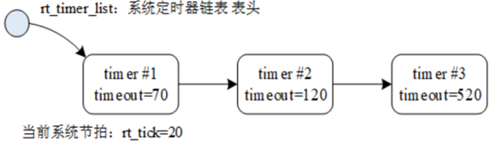

如图所示，系统当前tick值为20，在当前系统中已经创建并启动了三个定时器，分别是定时时间为50个tick的Timer1、100个tick的Timer2和500个tick的Timer3，

这三个定时器分别加上系统当前时间 rt_tick=20，从小到大排序链接在 rt_timer_list 链表中，形成如图所示的定时器链表结构。

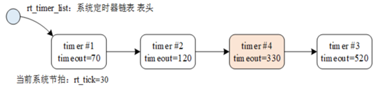

而 rt_tick 随着硬件定时器的触发一直在增长（每一次硬件定时器中断来临，rt_tick 变量会加 1） ，

50个tick以后，rt_tick从20增长到70，与Timer1的timeout值相等，这时会触发与Timer1定时器相关联的超时函数，同时将Timer1从rt_timer_list链表上删除。

同理，100个tick和500个tick过去后，与Timer2 和 Timer3 定时器相关联的超时函数会被触发，接着将 Time2 和 Timer3 定时器从 rt_timer_list链表中删除。

如果系统当前定时器状态在 10 个 tick 以后（rt_tick=30）有一个任务新创建了一个 tick 值为 300 的Timer4定时器，由于Timer4定时器的`timeout=rt_tick+300=330`,因此它将被插入到Timer2和Timer3定时器中间，形成如图所示链表结构

## 定时器相关接口

### 动态创建一个定时器和删除定时器

```c
/**
 * 此函数将创建一个定时器
 *
 * @param name 定时器的名称
 * @param timeout 超时函数
 * @param parameter 超时函数的参数
 * @param time 定时器的时钟节拍
 * @param flag 定时器的标志，有一下四种值 **/
		/**  #define RT_TIMER_FLAG_ONE_SHOT         0x0            一次性定时器 **/
		/**#define RT_TIMER_FLAG_PERIODIC           0x2            < 周期性定时器  **/
		/**    #define RT_TIMER_FLAG_HARD_TIMER      0x0             < 硬件定时器，定时器的回调函数将在时钟中断服务例程中被调用。 **/
		/**  #define RT_TIMER_FLAG_SOFT_TIMER       0x4            < 软件定时器，定时器的回调函数将在定时器线程中被调用。 **/
//  @return 创建的定时器对象

rt_timer_t rt_timer_create(
    const char *name,
    void (*timeout)(void *parameter),
    void       *parameter,
    rt_tick_t   time,
    rt_uint8_t  flag
);

/**
 * 此函数将删除一个定时器并释放定时器内存
 *
 * @param timer 要删除的定时器
 *
 * @return 操作状态，RT_EOK 表示成功；RT_ERROR 表示错误
 */
rt_err_t rt_timer_delete(rt_timer_t timer)
```

### 初始化和脱离静态定时器

```c
/**
 * 此函数将初始化一个定时器，通常该函数用于初始化一个静态定时器对象。
 *
 * @param timer 静态定时器对象 （typedef struct rt_timer *rt_timer_t;）
 * @param name 定时器的名称
 * @param timeout 超时函数
 * @param parameter 超时函数的参数
 * @param time 定时器的时钟节拍
 * @param flag 定时器的标志
 */
void rt_timer_init(
    rt_timer_t  timer,
    const char *name,、
    void (*timeout)(void *parameter),
    void       *parameter,
    rt_tick_t   time,rt_uint8_t  flag
);

/**
 * 此函数将从定时器管理中分离一个定时器。
 *
 * @param timer 静态定时器对象
 *
 * @return 操作状态，RT_EOK 表示成功；RT_ERROR 表示错误
 */
rt_err_t rt_timer_detach(rt_timer_t timer)
```

### 启动和停止定时器

```c
/**
 * 此函数将启动定时器
 *
 * @param timer 要启动的定时器
 *
 * @return 操作状态，RT_EOK 表示成功，-RT_ERROR 表示错误
 */
rt_err_t rt_timer_start(rt_timer_t timer);

/**
 * 此函数将停止定时器
 *
 * @param timer 要停止的定时器
 *
 * @return 操作状态，RT_EOK 表示成功，-RT_ERROR 表示错误
 */
rt_err_t rt_timer_stop(rt_timer_t timer)
```

### 控制定时器

```c
/**
 * 此函数将获取或设置定时器的某些选项
 *
 * @param timer 要获取或设置的定时器
 * @param cmd 控制命令
 * @param arg 参数
 * #define RT_TIMER_CTRL_SET_TIME          0x0            /**< 设置定时器控制命令 
* #define RT_TIMER_CTRL_GET_TIME          0x1    */        /**< 获取定时器控制命令 
    * #define RT_TIMER_CTRL_SET_ONESHOT       0x2   */         /**< 将定时器更改为一次性 
    * #define RT_TIMER_CTRL_SET_PERIODIC      0x3  */           /**< 将定时器更改为周期性 */
// @return RT_EOK
*/
    rt_err_t rt_timer_control(rt_timer_t timer, int cmd, void *arg)
```

### 高精度延时

```c
/**
 * 此函数将延迟若干微秒。
 *
 * @param us 延迟的微秒数
 */
void rt_hw_us_delay(rt_uint32_t us)
```

# 线程间同步

多个执行单元（线程、中断）同时执行临界区，操作临界资源，会导致竟态产生，为了解决这种竟态问题，RT-Thread OS提供了如下几种同步互斥机制：

- 信号量
-  互斥量
- 事件集

## 信号量

### 信号量结构体

```c
struct rt_semaphore
{
    struct rt_ipc_object parent;  /**< inherit from ipc_object  继承自ipc_object类*/

    rt_uint16_t          value;       /**< value of semaphore. */
    rt_uint16_t          reserved;    /**< reserved field 预留*/ 
};
typedef struct rt_semaphore *rt_sem_t;

```

### 信号量的使用和管理

对一个信号量的操作包含：创建 / 初始化信号量、获取信号量、释放信号量、删除 / 脱离信号量。

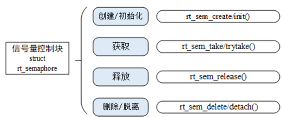

###  创建和删除信号量

```c
/* 此函数将从系统资源创建一个信号量
@param name 信号量的名称
@param value 信号量的初始值
@param flag 信号量的标志
	#define RT_IPC_FLAG_FIFO 0x00  //< 先进先出的 IPC。@ref IPC. // 按先进先出获取信号量资源
	#define RT_IPC_FLAG_PRIO  0x01  //< 优先级的 IPC。@ref IPC. // 按线程优先级获取信号量资源

@return 创建的信号量，出错时返回 RT_NULL

请参阅 rt_sem_init
**/
sem_t rt_sem_create(const char *name, rt_uint32_t value, rt_uint8_t flag)

```

系统不再使用信号量时，可通过删除信号量以释放系统资源，适用于动态创建的信号量。

调用这个函数时，系统将删除这个信号量。如果删除该信号量时，有线程正在等待该信号量，那么删除操作会先唤醒等待在该信号量上的线程（等待线程的返回值是-RT_ERROR），然后再释放信号量的内存资源

```c
/**
 * 此函数将删除一个信号量对象并释放内存
 *
 * @param sem 信号量对象
 *
 * @return 错误代码
 *
 * @see rt_sem_detach
 */
rt_err_t rt_sem_delete(rt_sem_t sem)
```

### 初始化和脱离静态信号量

```c
/**
 * 此函数将初始化一个信号量，并将其置于资源管理的控制之下。
 *
 * @param sem 信号量对象
 * @param name 信号量的名称
 * @param value 信号量的初始值
 * @param flag 信号量的标志
 *
 * @return 操作状态，成功时返回 RT_EOK
 */
rt_err_t rt_sem_init(rt_sem_t    sem,
                     const char *name,
                     rt_uint32_t value,
                     rt_uint8_t  flag);

/**
 * 此函数将使一个信号量从资源管理中分离
 *
 * @param sem 信号量对象
 *
 * @return 操作状态，成功时返回 RT_EOK
 *
 * @see rt_sem_delete
 */
rt_err_t rt_sem_detach(rt_sem_t sem)
```

### 获取信号量

线程通过获取信号量来获得信号量资源实例，

当信号量值大于零时，线程将获得信号量，并且相应的信号量值会减 1，

如果信号量的值等于零，那么说明当前信号量资源实例不可用，申请该信号量的线程将根据time参数的情况选择直接返回、或挂起等待一段时间、或永久等待，直到其他线程或中断释放该信号量。

如果在参数time指定的时间内依然得不到信号量，线程将超时返回，返回值是 - RT_ETIMEOUT。

```c
/**
 * 此函数会将一个信号量从资源管理中分离
 *
 * @param sem 信号量对象
 *
 * @return 操作状态，成功时返回 RT_EOK
 *
 * @see rt_sem_delete
 */
rt_err_t rt_sem_detach(rt_sem_t sem)
```

```c
/**
 此函数将获取一个信号量，如果信号量不可用，线程应等待指定的时间。

@param sem 信号量对象
@param time 等待时间
#define RT_WAITING_FOREVER -1 //<永远阻塞，直到获取资源
#define RT_WAITING_No 0  //<非阻塞。//

@return 错误代码
**/
rt_err_t rt_sem_take(rt_sem_t sem, rt_int32_t time)
rt_err_t rt_sem_trytake(rt_sem_t sem); // 等价于 rt_sem_take(sem, RT_WAITING_NO) ;

```

### 释放信号量

释放信号量可以唤醒挂起在该信号量上的线程

```c
/**
 * 此函数将释放一个信号量，如果有线程在该信号量上挂起，它将被唤醒。
 *
 * @param sem 信号量对象
 *
 * @return 错误代码
 */
rt_err_t rt_sem_release(rt_sem_t sem)
```

## 互斥量

互斥量体现的是排他性，也是解决多线程同时操作临界区临界资源导致的竟态的一种方法。（类似于特殊的信号量——二值信号量）

区别：信号量可由不同线程释放，互斥量只能由同一线程进行释放。

### 互斥量的使用和管理

互斥量的操作包含：创建 / 初始化互斥量、获取互斥量、释放互斥量、删除 / 脱离互斥量

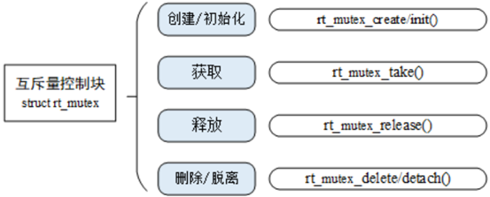

### 创建和删除

```c
struct rt_mutex{
    struct rt_ipc_object parent; //< 继承自 ipc_object 类
    rt_uint16_t value; //< 互斥量值
    rt_uint8_t  original_priority; //< 上一个持有该互斥量的线程的优先级
    rt_uint8_t hold; //< 持有该互斥量的线程的持锁次数
    struct rt_thread *owner;
    //< 当前持锁线程
};
typedef struct rt_mutex *rt_mutex_t;/**
* 此函数将从系统资源创建一个互斥量
*
* @param name 互斥量的名称
* @param flag 互斥量的标志 RT_IPC_FLAG_FIFO / RT_IPC_FLAG_PRIO
* @return 创建的互斥量，出错时返回 RT_NULL
*
* @see rt_mutex_init
*/
rt_mutex_t rt_mutex_create(const char *name, rt_uint8_t flag);

//不再使用互斥量时，通过删除互斥量以释放系统资源，适用于动态创建的互斥量

//当删除一个互斥量时，所有等待此互斥量的线程都将被唤醒，等待线程获得的返回值是 - RT_ERROR
rt_err_t rt_mutex_delete(rt_mutex_t mutex)
```

### 初始化和脱离互斥量

```c
/**
 * 此函数将初始化一个互斥量，并将其置于资源管理的控制之下。
 *
 * @param mutex 互斥量对象
 * @param name 互斥量的名称
 * @param flag 互斥量的标志
 *
 * @return 操作状态，成功时返回 RT_EOK
 */
rt_err_t rt_mutex_init(rt_mutex_t mutex, const char *name, rt_uint8_t flag);

/**
 * 此函数将使一个互斥量从资源管理中分离
 *
 * @param mutex 互斥量对象
 *
 * @return 操作状态，成功时返回 RT_EOK
 *
 * @see rt_mutex_delete
 */
rt_err_t rt_mutex_detach(rt_mutex_t mutex)
```


### 获取和释放互斥量

```c
/**
 * 此函数将获取一个互斥量，如果互斥量不可用，线程应等待指定的时间。
 *
 * @param mutex 互斥量对象
 * @param time 等待时间
 *
 * @return 错误代码
 */
rt_err_t rt_mutex_take(rt_mutex_t mutex, rt_int32_t time);


/**
 * 此函数将释放一个互斥量，如果有线程在该互斥量上挂起，它将被唤醒。
 *
 * @param mutex 互斥量对象
 *
 * @return 错误代码
 */
rt_err_t rt_mutex_release(rt_mutex_t mutex)
```

## 事件集

事件集也是线程间同步的机制之一，一个事件集可以包含多个事件，利用事件集可以完成一对多，多对多的线程间同步。

一个线程和多个事件的关系可设置为：

- 其中任意一个事件唤醒线程，或几个事件都到达后唤醒线程，
- 多个事件集合可以用一个32bit无符号整型变量来表示，变量的每一位代表一个事件，
- 线程通过"逻辑与"或"逻辑或"将一个或多个事件关联起来，形成事件组合。

RT-Thread 定义的事件集有以下特点：

-  事件只与线程相关，事件间相互独立
- 事件仅用于同步，不提供数据传输功能
- 事件无排队性，即多次向线程发送同一事件(如果线程还未来得及读走)，其效果等同于只发送一次

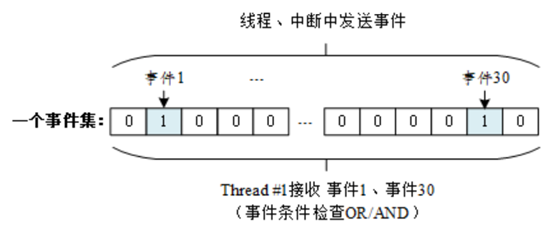

### 事件集使用和管理方法

对一个事件集的操作包含：创建/初始化事件集、发送事件、接收事件、删除/脱离事件集

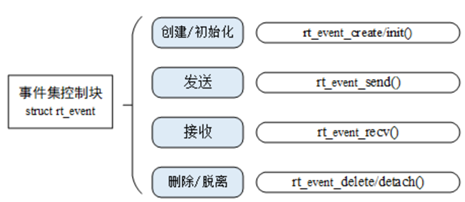

### 创建和删除

```c
/*
 * 事件结构
 */
struct rt_event
{
    struct rt_ipc_object parent;      /**< 继承自 ipc_object */

    rt_uint32_t          set;         /**< 事件集 */
};
typedef struct rt_event *rt_event_t;

/**
 * 此函数将从系统资源创建一个事件对象
 *
 * @param name 事件的名称
 * @param flag 事件的标志 RT_IPC_FLAG_FIFO RT_IPC_FLAG_PRIO
 *
 * @return 创建的事件，出错时返回 RT_NULL
 */
rt_event_t rt_event_create(const char *name, rt_uint8_t flag);

/**
 * 此函数将删除一个事件对象并释放内存
 *
 * @param event 事件对象
 *
 * @return 错误代码
 */
rt_err_t rt_event_delete(rt_event_t event)
```

### 初始化和脱离

```c
/**
 * 此函数将初始化一个事件，并将其置于资源管理的控制之下。
 *
 * @param event 事件对象
 * @param name 事件的名称
 * @param flag 事件的标志
 *
 * @return 操作状态，成功时返回 RT_EOK
 */
rt_err_t rt_event_init(rt_event_t event, const char *name, rt_uint8_t flag);

/**
 * 此函数将使一个事件对象从资源管理中分离
 *
 * @param event 事件对象
 *
 * @return 操作状态，成功时返回 RT_EOK
 */
rt_err_t rt_event_detach(rt_event_t event)
```

### 发送事件

```c
/**
 * 此函数将向事件对象发送一个事件，如果有线程在该事件对象上挂起，它将被唤醒。
 *
 * @param event 事件对象
 * @param set 事件集
 *
 * @return 错误代码
 */
rt_err_t rt_event_send(rt_event_t event, rt_uint32_t set)
```

###  接收事件

```c
/**
 * 此函数将从事件对象接收一个事件，如果事件不可用，线程应等待指定的时间。
 *
 * @param event 快速事件对象
 * @param set 感兴趣的事件集
 * @param option 接收选项，应设置 RT_EVENT_FLAG_AND 或 RT_EVENT_FLAG_OR。RT_EVENT_FLAG_CLEAR
 * @param timeout 等待时间 RT_WAITING_FOREVER RT_WAITING_NO
 * @param recved 接收到的事件，如果不关心，可以设置为 RT_NULL。
 *
 * @return 错误代码
 */
rt_err_t rt_event_recv(rt_event_t   event,
                       rt_uint32_t  set,
                       rt_uint8_t   option,
                       rt_int32_t   timeout,
                       rt_uint32_t *recved)
```

### 案例

```c
<rtthread.h>

#define DBG_TAG "main"
#define DBG_LVL DBG_LOG
#include <rtdbg.h>

rt_event_t event1;

rt_thread_t th1 , th2 ,th3;

#define EVENT_FLAGS_1 (0x1 << 1)
#define EVENT_FLAGS_2 (0x1 << 2)
#define EVENT_FLAGS_3 (0x1 << 3)


void th1_entry(void *parameter)
{
    rt_thread_mdelay(1000);
    while(1){
        rt_event_recv(event1, EVENT_FLAGS_1,RT_EVENT_FLAG_AND|RT_EVENT_FLAG_CLEAR, RT_WAITING_FOREVER, NULL);
        rt_kprintf("th1_entry...\n");
        rt_thread_mdelay(1000);
        rt_event_send(event1, EVENT_FLAGS_2);
    }
}

void th2_entry(void *parameter)
{
    rt_thread_mdelay(500);
    while(1){
        rt_event_recv(event1, EVENT_FLAGS_2,RT_EVENT_FLAG_AND|RT_EVENT_FLAG_CLEAR, RT_WAITING_FOREVER, NULL);
        rt_kprintf("th2_entry...\n");
        rt_thread_mdelay(1000);
        rt_event_send(event1, EVENT_FLAGS_3);
    }
}

void th3_entry(void *parameter)
{
    int ret = 0;
    while(1){
        ret = rt_event_recv(event1, EVENT_FLAGS_3,RT_EVENT_FLAG_AND|RT_EVENT_FLAG_CLEAR, RT_WAITING_FOREVER, NULL);
        rt_kprintf("th3_entry[%d]...\n",ret);
        rt_thread_mdelay(1000);
        rt_event_send(event1, EVENT_FLAGS_1);
    }
}

int main(void)
{
    event1 = rt_event_create("set1", RT_IPC_FLAG_FIFO);
    if(event1 == RT_NULL){
        LOG_E("rt_event_create failed...\n");
        return -ENOMEM;
    }

    LOG_D("rt_event_create successed...\n");

    th1 = rt_thread_create("th1", th1_entry, NULL, 1024, 20, 5);
    if(th1 == RT_NULL){
        LOG_E("rt_thread_create failed...\n");
        return -ENOMEM;
    }

    th2 = rt_thread_create("th2", th2_entry, NULL, 1024, 20, 5);
    if(th2 == RT_NULL){
        LOG_E("rt_thread_create failed...\n");
        return -ENOMEM;
    }

    th3 = rt_thread_create("th3", th3_entry, NULL, 1024, 20, 5);
    if(th3 == RT_NULL){
        LOG_E("rt_thread_create failed...\n");
        return -ENOMEM;
    }

    rt_thread_startup(th1);
    rt_thread_startup(th2);
    rt_thread_startup(th3);

    rt_thread_mdelay(5000);
    rt_event_send(event1, EVENT_FLAGS_1);

    return 0;
}


```


# IO设备模型

## 框架

RT-Thread 提供了一套简单的 I/O 设备模型框架，如下图所示，它位于硬件和应用程序之间，共分成三层，从上到下分别是 I/O 设备管理层、设备驱动框架层、设备驱动层。

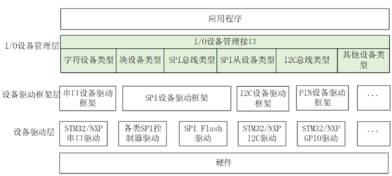

- 应用程序通过 I/O 设备管理接口获得正确的设备驱动，然后通过这个设备驱动与底层 I/O 硬件设备进行交互。
-  I/O 设备管理层实现了对设备驱动程序的封装
- 设备驱动框架层是对同类硬件设备驱动的抽象，将不同厂家的同类硬件设备驱动中相同的部分抽取出来，将不同部分留出接口，由驱动程序实现。
-  设备驱动层是一组驱使硬件设备工作的程序，实现访问硬件设备的功能。

## 简单设备的注册

简单设备的注册不经过设备驱动框架层，直接将设备注册到I/O设备管理器中

- 设备驱动根据设备模型定义，创建出具备硬件访问能力的设备实例，将该设备通过`rt_device_register()`接口注册到 I/O 设备管理器中
- 应用程序通过` rt_device_find()`接口查找到设备，然后使用 I/O 设备管理接口来访问硬件，如下图所示：

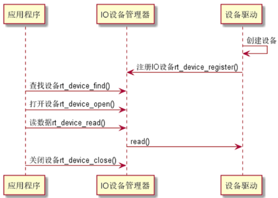

## 复杂设备注册

对于一些复杂设备，需要使用到对应的设备驱动框架层，进行注册，如：看门狗定时器

- 看门狗设备驱动程序根据看门狗设备模型定义，创建出具备硬件访问能力的看门狗设备实例，并将该看门狗设备通过 `rt_hw_watchdog_register()`接口注册到看门狗设备驱动框架中
-  看门狗设备驱动框架通过 `rt_device_register()`接口将看门狗设备注册到 I/O 设备管理器中
-  应用程序通过 I/O 设备管理接口来访问看门狗设备硬件

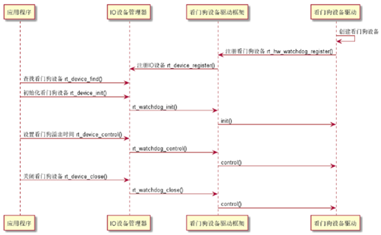

## IO设备类型

RT-Thread 支持多种 I/O 设备类型，主要设备类型如下所示

```c
RT_Device_Class_Char = 0,                           /**< 字符设备 */     
    RT_Device_Class_Block,                              /**< 块设备 */     
    RT_Device_Class_NetIf,                              /**< 网络接口 */     
    RT_Device_Class_MTD,                                /**< 内存设备 */     
    RT_Device_Class_CAN,                                /**< CAN 设备 */     
    RT_Device_Class_RTC,                                /**< RTC 设备 */     
    RT_Device_Class_Sound,                              /**< 声音设备 */     
    RT_Device_Class_Graphic,                            /**< 图形设备 */     
    RT_Device_Class_I2CBUS,                             /**< I2C 总线设备 */     
    RT_Device_Class_USBDevice,                          /**< USB 从设备 */     
    RT_Device_Class_USBHost,                            /**< USB 主机总线 */     
    RT_Device_Class_SPIBUS,                             /**< SPI 总线设备 */     
    RT_Device_Class_SPIDevice,                          /**< SPI 设备 */     
    RT_Device_Class_SDIO,                               /**< SDIO 总线设备 */     
    RT_Device_Class_Timer,                              /**< 定时器设备 */     
    RT_Device_Class_Miscellaneous,                      /**< 杂项设备 */     
    RT_Device_Class_Sensor,                             /**< 传感器设备 */     
    RT_Device_Class_Touch,                              /**< 触摸设备 */     
    RT_Device_Class_Unknown                             /**< 未知设备 */
```

## 创建和注册IO设备

驱动层负责创建设备实例，并注册到 I/O 设备管理器中

```c
/**
* 此函数创建一个具有用户数据大小的设备对象。
*
* @param type 此设备对象的类型。
* @param attach_size 用户数据的大小。
* @return 分配的设备对象，失败时返回 RT_NULL 。
*/
rt_device_t rt_device_create(int type, int attach_size);

/**
* 此函数销毁特定的设备对象。
*
* @param dev 特定的设备对象。
*/
void rt_device_destroy(rt_device_t dev)

```

设备被创建后，需要实现它访问硬件的操作方法

```c
struct rt_device_ops{
    /*common device interface*/
    rt_err_t(*init)(rt_device_t dev) ;
    rt_err_t(*open)(rt_device_t dev,rt_uint16_t oflag);
    rt_err_t(*close)(rt_device_t dev) ;
    rt_size_t (*read) (rt_device_t dev,rt_off_t pos，void *buffer,rt_size_t size);
    rt_size_t (*write) (rt_device_t dev,rt_off_t pos,const void *buffer,rt_size_t size);
    rt_err_t (*control)(rt_device_t dev,int cmd,void *args);
}
```

设备被创建后，需要注册到 I/O 设备管理器中，应用程序才能够访问

```c
/**
 * 此函数使用指定名称注册一个设备驱动程序。
 *
 * @param dev 设备驱动程序结构的指针
 * @param name 设备驱动程序的名称
 * @param flags 设备的功能标志  设备模式标志
 *
 * @return 错误代码，初始化成功时返回 RT_EOK 。
 */
rt_err_t rt_device_register(rt_device_t dev,
                            const char *name,
                            rt_uint16_t flags);

#define RT_DEVICE_FLAG_RDONLY 0x001 /* 只读 */
#define RT_DEVICE_FLAG_WRONLY 0x002 /* 只写 */
#define RT_DEVICE_FLAG_RDWR 0x003 /* 读写 */
#define RT_DEVICE_FLAG_REMOVABLE 0x004 /* 可移除 */
#define RT_DEVICE_FLAG_STANDALONE 0x008 /* 独立 */
#define RT_DEVICE_FLAG_SUSPENDED 0x020 /* 挂起 */
#define RT_DEVICE_FLAG_STREAM 0x040 /* 流模式 */
#define RT_DEVICE_FLAG_INT_RX 0x100 /* 中断接收 */
#define RT_DEVICE_FLAG_DMA_RX 0x200 /* DMA 接收 */
#define RT_DEVICE_FLAG_INT_TX 0x400 /* 中断发送 */
#define RT_DEVICE_FLAG_DMA_TX 0x800 /* DMA 发送 */

//设备注销后，设备将从设备管理器中移除，也就不能再通过设备查找搜索到该设备。注销设备不会释放设备控制块占用的内存

/**
 * 此函数移除先前注册的设备驱动程序
 *
 * @param dev 设备驱动程序结构的指针
 *
 * @return 错误代码，成功时返回 RT_EOK 。
 */
rt_err_t rt_device_unregister(rt_device_t dev)
```

## 访问IO设备

应用程序通过 I/O 设备管理接口来访问硬件设备，当设备驱动实现后，应用程序就可以访问该硬件，I/O 设备管理接口与 I/O 设备的操作方法的映射关系下图所示

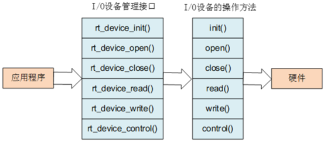

### 查找设备

```c
/**
 * 此函数通过指定名称查找设备驱动程序。
 *
 * @param name 设备驱动程序的名称
 *
 * @return 成功时返回已注册的设备驱动程序，失败时返回 RT_NULL 。
 */
rt_device_t rt_device_find(const char *name);
```


### 初始化设备

```c
/**
* 此函数将初始化指定的设备
*
* @param dev 设备驱动程序结构的指针
*
* @return 结果
*/
rt_err_t rt_device_init(rt_device_t dev);
```


### 打开和关闭设备


```c
/**
* 此函数将打开一个设备
*
* @param dev 设备驱动程序结构的指针
* @param oflag 设备打开的标志
*
* @return 结果
*/
rt_err_t rt_device_open(rt_device_t dev, rt_uint16_t oflag);
// oflags 支持以下的参数:
#define RT_DEVICE_OFLAG_CLOSE ox000 /* 设备已经关闭（内部使用） */
#define RT_DEVICE_OFLAG_RDONLY Ox001 /* 以只读方式打开设备 */
#define RT_DEVICE_OFLAG_WRONLY ox802 /* 以只写方式打开设备 */
#define RT_DEVICE_OFLAG_RDWR Ox003 /* 以读写方式打开设备 */
#define RT_DEVICE_OFLAG_OPEN 0x008 /* 设备已经打开（内部使用） */
#define RT_DEVICE_FLAG_STREAM 0x040 /* 设备以流模式打开 */
#define RT_DEVICE_FLAG_INT_RX 0x100 /* 设备以中断接收模式打开 */
#define RT_DEVICE_FLAG_DMA_RX 0x200 /* 设备以 DMA 接收模式打开 */
#define RT_DEVICE_FLAG_INT_TX 0x400 /* 设备以中断发送模式打开 */
#define RT_DEVICE_FLAG_DMA_TX 0x800 /* 设备以 DMA 发送模式打开 */

```

 *注：RT_DEVICE_FLAG_STREAM：流模式用于向串口终端输出字符串：当输出的字符是 "\n"（对应 16 进制值为 0x0A）时，自动在前面输出一个 "\r"（对应 16 进制值为 0x0D）做分行。*


*流模式 RT_DEVICE_FLAG_STREAM 可以和接收发送模式参数使用或 “|” 运算符一起使用*

```c
/**
* 此函数将关闭一个设备
*
* @param dev 设备驱动程序结构的指针
*
* @return 结果
*/
rt_err_t rt_device_close(rt_device_t dev)
```


### 控制设备

```c
/**
* 此函数将关闭一个设备
*
* @param dev 设备驱动程序结构的指针
*
* @return 结果
*/
rt_err_t rt_device_close(rt_device_t dev)
```

### 读写设备

```c
/**
 * 此函数将从设备读取一些数据。
 *
 * @param dev 设备驱动程序结构的指针
 * @param pos 读取的位置
 * @param buffer 用于保存读取数据的数据缓冲区
 * @param size 缓冲区的大小
 *
 * @return 成功时返回实际读取的大小，否则返回负值。
 *
 * @note 自 0.4.0 起，对于块设备，size/pos 的单位是块。
 */
rt_size_t rt_device_read(rt_device_t dev,
                         rt_off_t    pos,
                         void       *buffer,
                         rt_size_t   size)
```

### 数据收发回调

```c
/**
 * 此函数将设置接收指示回调函数。当此设备接收到数据时，会调用此回调函数。
 *
 * @param dev 设备驱动程序结构的指针
 * @param rx_ind 指示回调函数
 *
 * @return RT_EOK
 */
rt_err_t
    rt_device_set_rx_indicate(
    rt_device_t dev,
    rt_err_t (*rx_ind)(rt_device_t dev, rt_size_t size)
);

/**
 * 此函数将设置当设备已将数据写入物理硬件时的指示回调函数。
 *
 * @param dev 设备驱动程序结构的指针
 * @param tx_done 指示回调函数
 *
 * @return RT_EOK
 */
rt_err_t
    rt_device_set_tx_complete(
    rt_device_t dev,
    rt_err_t (*tx_done)(rt_device_t dev, void *buffer)
)
```

# UART串口设备

## 访问串口设备接口

应用程序通过RT-Thread提供的IO设备管理接口来访问串口硬件

| 函数                        | 描述                 |
| --------------------------- | -------------------- |
| rt_device_open()            | 打开设备             |
| rt_device_find()            | 查找设备             |
| rt_device_read()            | 读取数据             |
| rt_device_write()           | 写入数据             |
| rt_device_control()         | 控制设备             |
| rt_device_set_rx_indicate() | 设置接收回调函数     |
| rt_device_set_tx_complete() | 设置发送完成回调函数 |
| rt_device_close()           | 关闭设备             |

查找串口设备（例："uart2"）

打开串口设备（串口收发数据模式：中断、轮询、DMA）

## 控制串口设备

```c
rt_err_t rt_device_control(rt_device_t dev, rt_uint8_t cmd, void* arg);
//cmd 命令控制字，可取值：RT_DEVICE_CTRL_CONFIG 
//arg   控制的参数，可取类型：struct serial_conigure
struct serial_configure
{
    rt_uint32_t baud_rate;    
    rt_uint32_t data_bits :4; 
    rt_uint32_t stop_bits :2;
    rt_uint32_t parity :2;    
    rt_uint32_t bit_order :1; 
    rt_uint32_t invert :1;    
    rt_uint32_t bufsz :16;    
    rt_uint32_t reserved :4; 
};

/* 波特率可取值*/
#define BAUD_RATE_2400 2400
#define BAUD_RATE_4800 4800
#define BAUD_RATE_9600 9600
#define BAUD_RATE_19200 19200
#define BAUD_RATE_38400 38400
#define BAUD_RATE_57600 57600
#define BAUD_RATE_115200 115200
#define BAUD_RATE_230400 230400
#define BAUD_RATE_460800 460800
#define BAUD_RATE_921600 921600
#define BAUD_RATE_2000000 2000000
#define BAUD_RATE_3000000 3000000
/* 数据位可取值*/
#define DATA_BITS_5 5
#define DATA_BITS_6 6
#define DATA_BITS_7 7
#define DATA_BITS_8 8
#define DATA_BITS_9 9
/*停止位可取值 */
#define STOP_BITS_1 0
#define STOP_BITS_2 1
#define STOP_BITS_3 2
#define STOP_BITS_4 3
/*极性位可取值*/
#define PARITY_NONE 0
#define PARITY_ODD 1
#define PARITY_EVEN 2
/* 高低位顺序可取值*/
#define BIT_ORDER_LSB 0
#define BIT_ORDER_MSB 1
/*模式可取值*/
#define NRZ_NORMAL 0 /* normal mode */
#define NRZ_INVERTED 1 /* inverted mode */
/* 接收数据缓冲区默认大小*/
#define RT_SERIAL_RB_BUFSZ 64

//RT-Thread 提供的默认串口配置
#define RT_SERIAL_CONFIG_DEFAULT 
{ 
    BAUD_RATE_115200, /* 115200 bits/s */ 
        DATA_BITS_8, /* 8 databits */ 
        STOP_BITS_1, /* 1 stopbit */ 
        PARITY_NONE, /* No parity */ 
        BIT_ORDER_LSB, /* LSB first sent */ 
        NRZ_NORMAL, /* Normal mode */ 
        RT_SERIAL_RB_BUFSZ, /* Buffer size */ 
        0 
}

```

*缓冲区通过 control 接口修改，缓冲区大小无法动态改变，只有在 open 设备之前可以配置。open 设备之后，缓冲区大小不可再进行更改。但除过缓冲区之外的其他参数，在 open 设备前 / 后，均可进行更改。*

### 发送数据

```c
rt_size_t rt_device_write(
    rt_device_t dev,
    rt_off_t pos ,
    const void*buffer,
    rt_size_t size
);
//注意: pos 写入数据偏移量，此参数串口设备未使用
//rt_size_t r

```

### 设置发送完成回调函数

在应用程序调用 rt_device_write()写入数据时，如果底层硬件能够支持自动发送，那么上层应用可以设置一个回调函数。这个回调函数会在底层硬件数据发送完成后 (例如 DMA 传送完成或 FIFO 已经写入完毕产生完成中断时) 调用

```c
rt_err_t rt_device_set_tx_complete(
    rt_device_t dev,
    rt_err_t (*tx_done)(rt_device_t dev , void *buffer) 
) ;

```

### 设置接收回调函数

若串口以中断接收模式打开，当串口接收到一个数据产生中断时，就会调用回调函数，并且会把此时缓冲区的数据大小放在size参数里，把串口设备句柄放在dev参数里供调用者获取。

 若串口以 DMA 接收模式打开，当 DMA 完成一批数据的接收后会调用此回调函数。

```c
rt_err_t rt_device_set_rx_indicate(
    rt_device_t dev , 
    rt_err_t (*rx_ind)(rt_device_t dev,rt_size_t size)
);

```

 *使用：一般情况下接收回调函数可以发送一个信号量或者事件通知串口数据处理线程有数据到达*

### 接收数据

```c
rt_size_t rt_device_read(
    rt_device_t dev, rt_off_t pos,
    void* buffer,
    rt_size_t size
);
//@pos读取数据偏移量,此参数串口设备未使用

```

### 关闭串口设备

```c
rt_err_t rt_device_close(rt_device_t dev);
```

# ADC设备

ADC(Analog-to-Digital Converter) 指模数转换器。是指将连续变化的模拟信号转换为离散的数字信号的器件。

ADC相关参数说明：

-  分辨率：
  - 分辨率以二进制（或十进制）数的位数来表示，一般有 8 位、10 位、12 位、16 位等，它说明模数转换器对输入信号的分辨能力，位数越多，表示分辨率越高，恢复模拟信号时会更精确。
-  精度：
  - 精度表示 ADC 器件在所有的数值点上对应的模拟值和真实值之间的最大误差值，也就是输出数值偏离线性最大的距离。
-  转换速率：
  - 转换速率是指 A/D 转换器完成一次从模拟到数字的 AD 转换所需时间的倒数。例如，某 A/D 转换器的转换速率为 1MHz，则表示完成一次 AD 转换时间为 1 微秒。


## 查找 ADC 设备

```c
rt_device_t rt_device_find(const char* name);
```

## 使能 ADC 通道

```c
rt_err_t rt_adc_enable(rt_adc_device_t dev, rt_uint32_t channel) 
//@dev ADC 设备句柄 
//@channel ADC 通道

```

##  读取 ADC 通道采样值

```c
rt_err_t rt_adc_enable(rt_adc_device_t dev, rt_uint32_t channel) 
//@dev ADC 设备句柄 
//@channel ADC 通道

```

## 关闭 ADC 通道

```c
rt_err_t rt_adc_disable(rt_adc_device_t dev, rt_uint32_t channel);
```

## FinSH 命令

在使用设备前，需要先查找设备是否存在，可以使用命令 adc probe后面跟注册的 ADC 设备的名称

```c
msh >adc probe adc1 probe adc1 success
```

使能设备的某个通道可以使用命令 adc enable后面跟通道号

```c
msh >adc enable 5 adc1 channel 5 enables success
```

读取 ADC 设备某个通道的数据可以使用命令 adc read后面跟通道号。

```
msh >adc read 5 adc1 channel 5 read value is 0x00000FFF msh >
```

关闭设备的某个通道可以使用命令 adc disable后面跟通道号

```c
msh >adc disable 5 adc1 channel 5 disable success msh >
```

## ADC使用流程

```c

```

# I2C设备

I2C（Inter Integrated Circuit）总线是 PHILIPS 公司开发的一种半双工、双向二线制同步串行总线。

I2C 总线传输数据时只需两根信号线：

- 双向数据线 SDA
-  双向时钟线 SCL

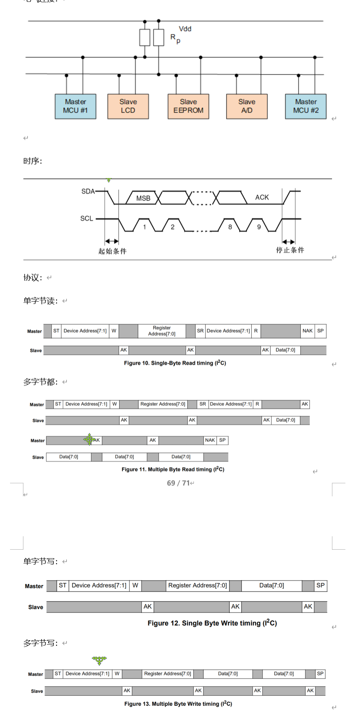


## 访问I2C总线设备

```c
#define AHT10_I2C_BUS_NAME "i2c1"/*传感器连接的I2C总线设备名称*/
struct rt_i2c_bus_device *i2c_bus;/*I2C总线设备句柄*/
/*for i2c bus driver*/
struct rt_i2c_bus_device{
    struct rt_device parent;
    const struct rt_i2c_bus_device_ops *ops;
    rt_uint16_t  flags;
    rt_uint16_t addr;
    struct rt_mutex lock;
    rt_uint32_t timeout;
    rt_uint32_tretries;
    void *priv;
};
/*查找I2C总线设备，获取I2C总线设备句柄*/
i2c_bus = ( struct rt_i2c_bus_device *)rt_device_find( name ) ;
rt_device_t rt_device_find( const char* name ) ;

```

## 数据传输

```c
#define RT_I2C_WR 0x0000    
#define RT_I2C_RD (1u << 0)

struct rt_i2c_msg
{
    rt_uint16_t addr;
    rt_uint16_t flags;
    rt_uint16_t len;
    rt_uint8_t  *buf;
};
rt_size_t rt_i2c_transfer(
    struct rt_i2c_bus_device *bus,
    struct rt_i2c_msg         msgs[],
    rt_uint32_t               num
)

```


